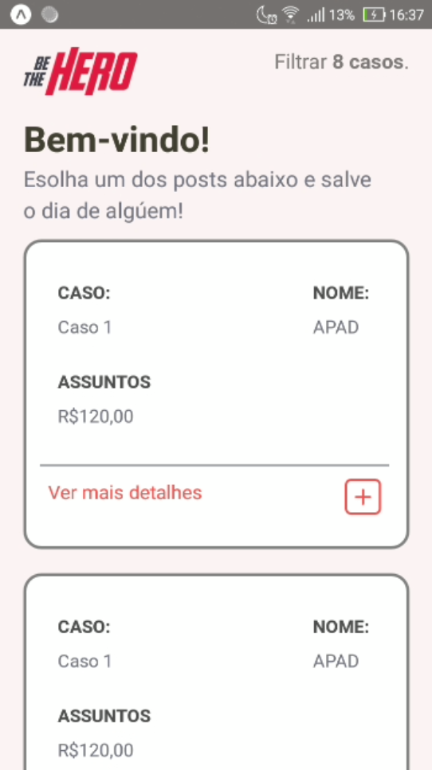
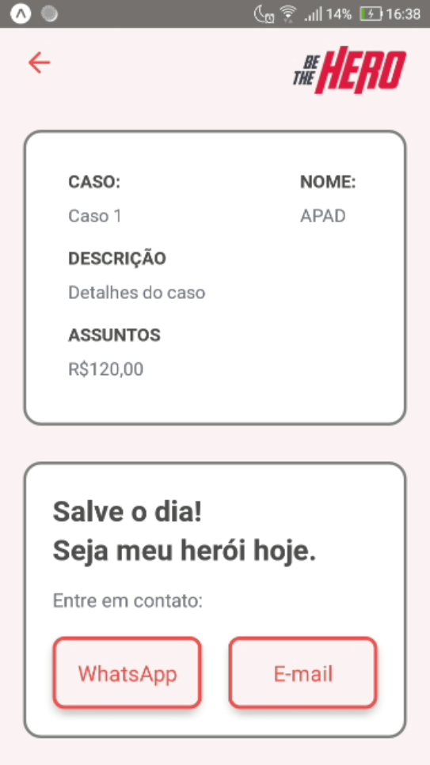
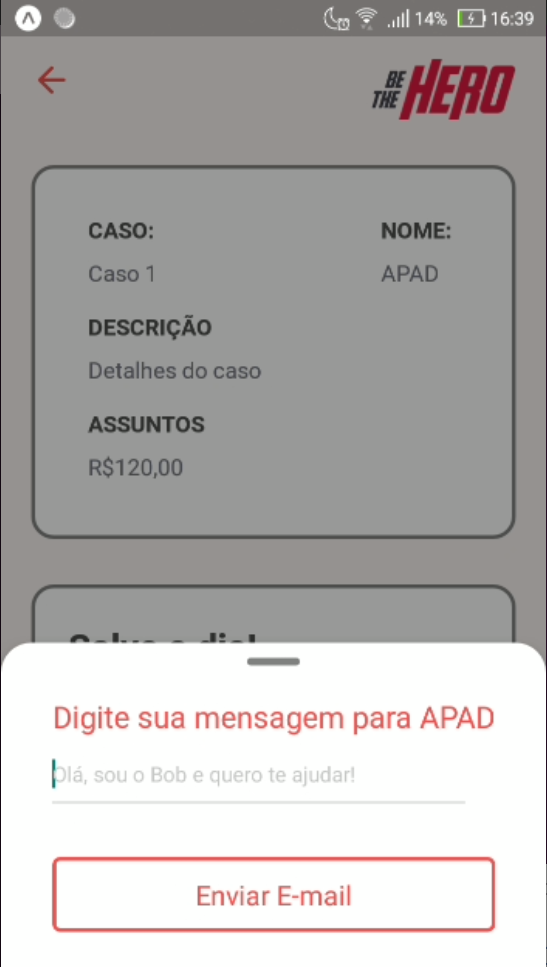
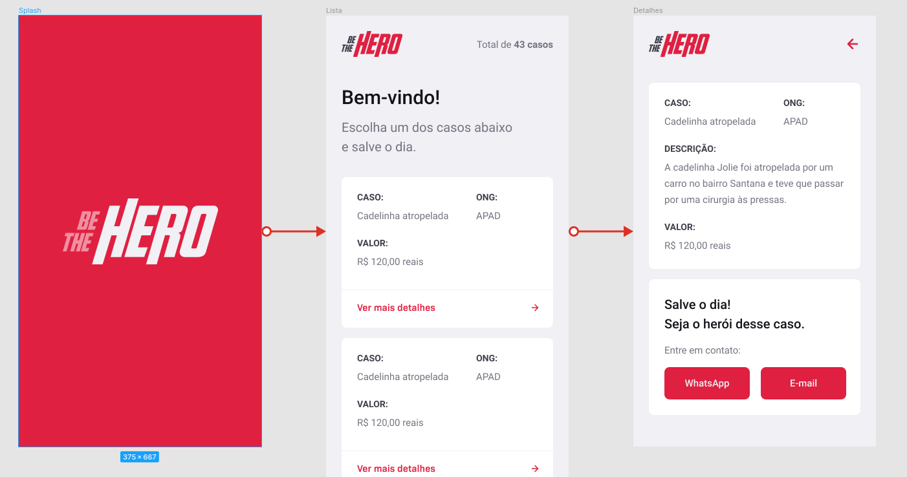

# My_Be_The_Hero

The mobile project I developed using react-native during the Omnistack-11 by Rocketseat.The idea of the app is to connect people that want to help NGO's with donations, helping them with their projects.

  

_________________________________________________________________________________________________________________________________________

    
 

    
     
     

_________________________________________________________________________________________________________________________________________

## Getting Started

This app was created using expo-cli:
- [Expo.io website](https://expo.io/learn)

1. Install npm and expoi cli in your computer
2. Clone this repository in the directory you want
3. Run expo install or yarn install to get the node_modules
4. [Download or clone the rocketseat project](https://github.com/Rocketseat/semana-omnistack-11)
5. Get the backend folder from the project you downloaded and run npm install
6. Inside the backend folder run npm start to run the backend on http://localhost:3333
7. Go back to the folder you cloned my repo and go to src/services/api.js
8. In this file change the baseUrl IP to your IP (example: http://192.160.0.101:3333)

_________________________________________________________________________________________________________________________________________

## Info

- [Layout on Figma](https://www.figma.com/file/2C2yvw7jsCOGmaNUDftX9n/Be-The-Hero---OmniStack-11?node-id=37%3A394) by Rocketseat
     

